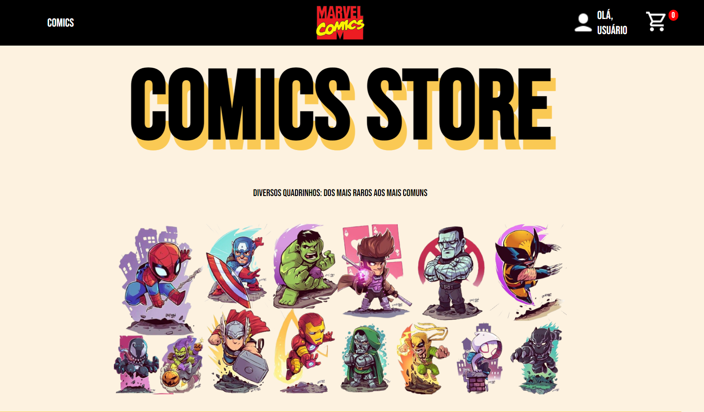
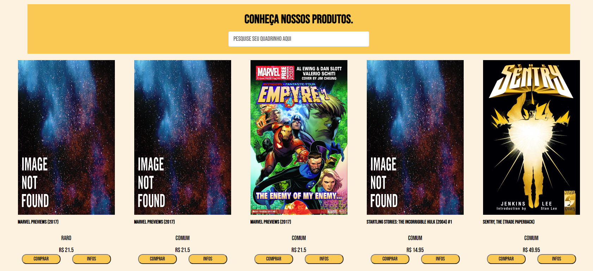
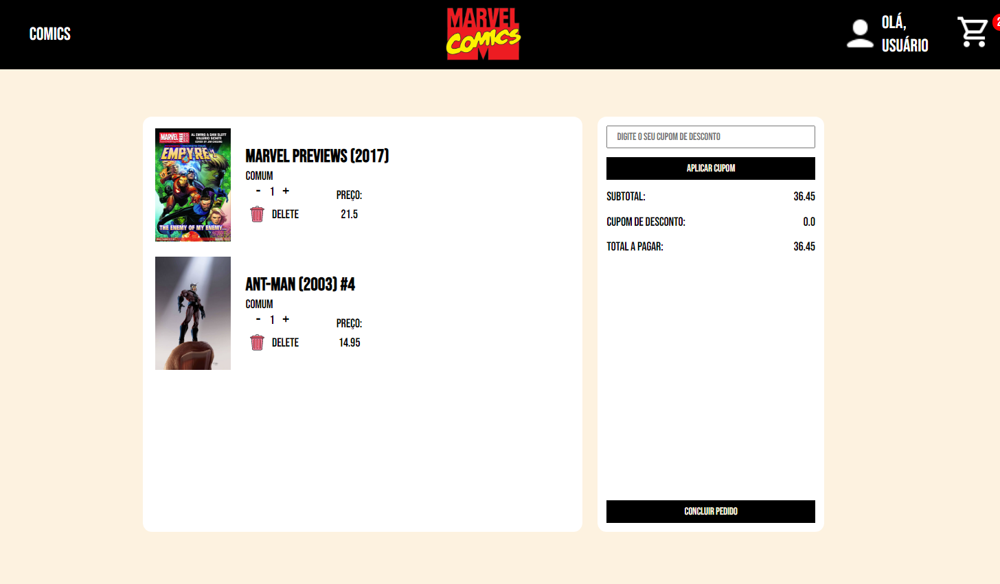

# **Desafio NeoApp**

O Desafio NeoApp consiste em desenvolver um E-Commerce de Quadrinhos da Marvel, contendo 3 páginas, a Home Page, Infos Page e Checkout Page. A Home é onde ficam os Cards contendo os quadrinhos, com a opção de comprá-los e ver mais informações, a Infos contém as informações detalhadas de cada quadrinho e a Checkout é onde o usuario finaliza as suas compras. O projeto tem como fonte de dados a <a href="https://gateway.marvel.com:443/v1/public/comics">API</a> fornecida pela empresa.

## 🔍**Índice**
* [Funcionalidades do projeto](#-funcionalidades-do-projeto)
* [Layout](#-layout)
* [Demonstração](#-demonstração)
* [Passos](#-passos)
* [Como rodar esse projeto?](#-como-rodar-esse-projeto?)
* [Tecnologias utilizadas](#-tecnologias-utilizadas)
* [Pessoas autoras](#-pessoas-autoras)
* [Cupom](#-cupom)


## 💻 **Funcionalidades do Projeto**
- [x] Utilização de ReactJs ou NextJs
- [x] Estilização feita com Styled Components
- [x] Realizar teste E2E com Cypress nos fluxos que achar necessário
- [x] Que a UI seja autoral do participante, esteticamente bonita e simples de usar
- [x] Layout responsivo / mobile first
- [x] Ver o website rodando em algum host estático (Heroku, Netlify, Vercel, Github Pages, etc)


## 🖼 **Layout**





## 🎯 **Demonstração**
[Link demonstração](site)

## 👨🏻‍🏫 **Passos**

No começo do projeto pensei em desenvolvê-lo para celular e com isso já fui pensando em como ficaria os cards dos quadrinhos e as imagens utilizadas para tal estilização. Após isso comecei a estilizá-lo e fazer a consumação da API para formar os cards. Com isso pronto, parti para a página de informações, onde gerei alguns detalhes do card. Por fim realizei a página de Checkout, tentando deixar mais próxima de um Checkout.

## 🕹 **Como rodar esse projeto?**

```
# Clone esse repositório
$ git clone https://github.com/brunomaschietto/desafio-neoapp

# Acesse a pasta do projeto no seu terminal
$ cd desafio-neopapp

# Instale as dependências
$ npm install

# Execute a aplicação
$ npm run dev
```


## ⚙️ **Tecnologias Utilizadas**

1. [React](https://pt-br.reactjs.org/)
2. [Axios](https://axios-http.com/ptbr/docs/intro)
3. [Styled-Components](https://styled-components.com/)
4. [React Router Dom](https://reactrouter.com/en/main)

## 👩🏻‍💻 **Pessoas autoras**

<p>Bruno Maschietto Simões Cruz</p>

[LinkedIn](https://www.linkedin.com/in/bruno-maschietto/)

## 📎 **Cupom**

O cupom para uso é VALE10%, ele te dará um desconto de 10% nos produtos.